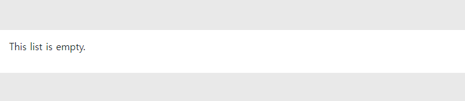
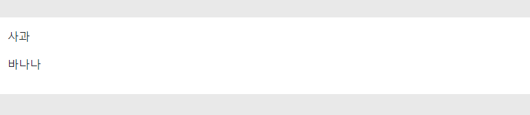
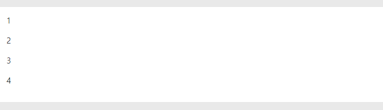
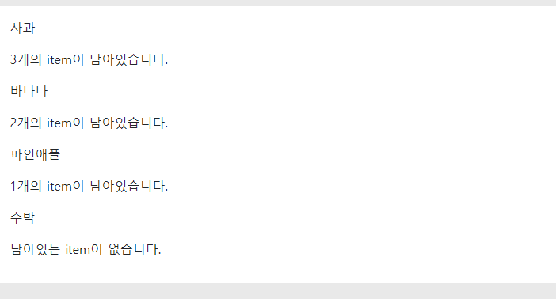
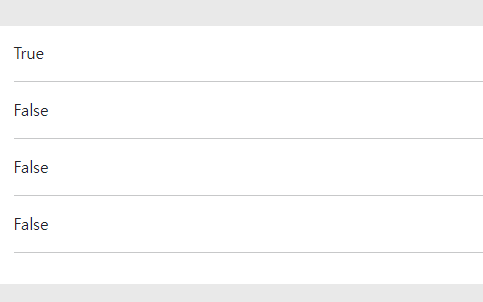
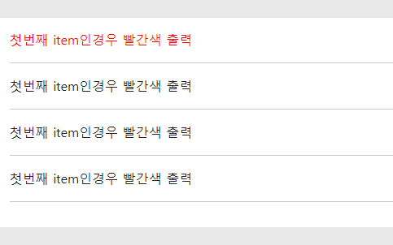

# **for문에 대해**

## **-INDEX-**
1. [기본 형식](#1-for문의-기본-형식)
2. [빈 리스트 처리](#2-빈-리스트-처리)
3. [역순으로 처리](#3-역순으로-처리)
4. [반복횟수 제한](#4-반복횟수-제한)
5. [인덱스 변수](#5-인덱스-변수)
    * 5-1. [forloop.counter](#5-1-forloopcounter)
    * 5-2. [forloop.revcounter](#5-2-forlooprevcounter)
    * 5-3. [forloop.first/last](#5-3-forloopfirstlast)

---

<br>
<br>

## **1. for문의 기본 형식**
- Django 템플릿에서 list를 반복하고 싶은경우 다음과 같이 코드를 작성 할 수 있다.
```html

    {{ item }}

```
* python 코드와 유사하나 반드시 반복문이 끝날때 을 작성해 주어야 한다.
* '{{ item }}'은 Django 템플릿에서 변수 값을 출력할때 사용하는 구문이며 list에서 꺼낸 item의 정보를 출력해준다

* 튜플이나 딕셔너리, 문자열 등 다른 시퀀스들도 순회가 가능하다.

<br>

### **Django 템플릿**에서 for문은 몇가지 기능을 추가로 제공되고 있는데 그 기능들은 다음과 같다.

<br>
<br>

## **2. 빈 리스트 처리**
* for 문은 빈 리스트에 대해 아무것도 실행하지 않지만 '`empty`' 키워드를 사용하면 빈 리스트에 대한 대체동작을 지정할 수 있다. 예시코드는 다음과 같다.
```html
    
      
    
      <p>This list is empty.</p>
    
```
* 위 코드는 review_images가 비어있으면 img를 생성하지않고 empty 밑의 p태그를 실행한다.



* 위 주제에서는 `slice`만 설명했지만 for문에서 `|` 뒤에 다양한 문법들을 사용할 수 있다.

<br>

### for문 | 관련 문법 정리

| **`변수`** | **`설명`** |
| ----------- | ----------- |
| date | 날짜를 특정 포맷에 맞추어 출력 |
| time | 시간을 특정 포맷에 맞추어 출력 |
| linebreaksbr | 개행 문자를 HTML `<br>` 태그로 변환하여 출력 |
| truncatechars | 문자열을 일정 길이로 자르고, 자른 문자열 뒤에 ...을 붙여 출력 |
| upper, lower | 문자열을 각각 대문자나 소문자로 변환하여 출력 |
| default | 변수가 None 또는 빈 문자열인 경우 대신 출력할 값을 지정 |
| default_if_none | 변수가 None인 경우 대신 출력할 값을 지정 |
| urlize | 문자열 안에 URL을 자동으로 링크 태그로 변환하여 출력 |
| length | 리스트나 문자열의 길이를 출력 |
| first, last | 리스트나 문자열의 첫 번째 또는 마지막 항목을 출력 |
| add | 변수와 숫자나 문자열을 더한 결과를 출력 |
| join | 리스트나 튜플의 요소들을 지정한 문자열로 연결하여 출력 |

* 위 정리에 대한 자세한 설명은 추후 추가 예정이다.

<br>
<br>

## **3. 역순으로 처리**
* Django는 views에서 list를 역순으로 정렬한 context를 템플릿으로 전달해서 for문을 사용해도 되지만 Django 템플릿에서 for문의 `reversed`를 통해 손쉽게 역순으로 리스트를 처리 할 수 있다.

* 다음과 같이 작성하면 list에서 item을 역순으로 처리할 수 있다.
```html

    {{ item }}

```

<br>
<br>

## **4. 반복횟수 제한**
* 반복횟수 제한 역시 view에서 slice할 필요 없이 list에 slice를 사용하여 반복 횟수를 제한할 수 있다.
* 다음은 fruit_list = ['사과', '바나나', '파인애플', '수박']으로 작성한 코드 예시이다.
```html

  <p>{{ item }}</p>

```
* 다음은 출력 결과이다.



<br>
<br>

## **5. 인덱스 변수**
* 인덱스 변수에 대해 설명하기 전에 먼저 Django 템플릿에서 사용가능한 변수를 알고가면 좋다.

| **`변수`** | **`설명`** |
| ----------- | ----------- |
| forloop.counter | 루프의 현재 반복상태를 index(1부터)값으로 표현 |
| forloop.counter0 | 루프의 현재 반복상태를 index(0부터)값으로 표현 |
| forloop.revcounter | 루프 끝에서 반복되는 횟수를 index(1부터)값으로 표현 |
| forloop.revcounter0 | 루프 끝에서 반복되는 횟수를 index(0부터)값으로 표현 |
| forloop.first | 루프의 첫번째 |
| forloop.last | 루프의 마지막 |
| forloop.parentloop | 중첩 루프일 경우 현재 루프의 부모 루프 |

<br>

### **5-1. forloop.counter**
* `forloop.counter`는 for문을 반복할때 현재 반복되고 있는 item을 index 값으로 출력해준다
* 다음은 fruit_list = ['사과', '바나나', '파인애플', '수박']으로 작성한 코드 예시이다.
```html

  <p>{{ forloop.counter }}</p>

```

* forloop_counter의 결과값은 python의 list의 인덱스와 다르게 1부터 시작한다.
* 0부터 시작하는 값을 넣고 싶으면 `forloop_counter0` 을 입력해주면 된다.
* forloop_counter은 각 div마다 특정 id값을 부여하거나 data값을 줄때 활용가능하다.

<br>

```html

  <div id="{{ forloop.counter0 }}"></div>

```

* 위처럼 div의 id값에 {{ forloop.counter0 }}을 입력한 경우 반복문을 순회할때마다 div id값에 현재 루프의 번호를 부여하여 생성할 수 있다. 이를 이용하면 중복되는 코드를 줄일 수 있는 장점이 있다.

<br>

### **5-2. forloop.revcounter**
* `forloop.revcounter`는 for문을 반복할때 루프 끝에서 반복되고 있는 item을 index 값으로 출력해준다
* 이를 이용하면 for문을 순회할때 순회할 item이 얼마나 남았는지 확인할 수 있다.
* 다음은 fruit_list = ['사과', '바나나', '파인애플', '수박']으로 작성한 코드 예시이다.
```html

    <p>{{ item }}</p>
  
    <p>{{forloop.revcounter0}}개의 item이 남아있습니다.</p>
  
    <p>남아있는 item이 없습니다.</p>
  

```

* 다음과 같이 `forloop.revcounter`을 이용해 코드를 작성하여 list의 남은 item의 수를 확인할 수 있다.

<br>

### **5-3. forloop.first/last**
* `forloop.first / last`는 for문을 반복할때 list의 첫번째(first) item과 마지막(last) item 의경우 True값으로 출력해준다.
* 다음은 fruit_list = ['사과', '바나나', '파인애플', '수박']으로 작성한 코드 예시이다.
```html

  <p>{{ forloop.first }}</p>
  <hr>

```


<br>

* 다음과 같이 첫번째 item일 경우 True값으로 출력이되고 나머지는 False로 출력되는 것을 볼 수있다.
* 이를 활용하면 for문을 통해 item을 생성할때 첫번째 또는 마지막 위치에만 class 속성을 다르게 부여하는 것이 가능하다. 밑의 사진과 코드를 통해 첫번째 class에만 다른 속성값을 부여하는 것을 확인할 수 있다.
```html
<style>
  .red {
    color: red;
  }
</style>


  <div class="red">첫번째 item인경우 빨간색 출력</div>
  <hr>

```



<br>

<br>

---
## **참고자료**
* https://docs.djangoproject.com/en/4.2/ref/templates/builtins/


<br>

<br>

<br>


### [위로](#for문에-대해) / [뒤로](/%EC%A0%95%EC%84%B8%ED%98%B8/django-template/README.md)