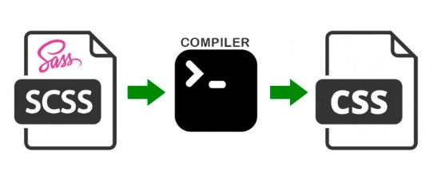

# django에서 SCSS 적용하기
## SCSS가 뭔데?
Sassy Cascading Style Sheets
[SCSS 공식페이지](https://sass-lang.com/guide)    
### SCSS 사용하면 얻을 수 있는 이점 예
1.  Nesting 들여쓰기 가능
    - 기존 CSS 코드
    ```css
    nav ul {
      margin: 0;
      padding: 0;
      list-style: none;
    }
    nav li {
      display: inline-block;
    }
    nav a {
      display: block;
      padding: 6px 12px;
      text-decoration: none;
    }

    label {

          padding: 3% 0px;
          width: 100%;
          cursor: pointer;
          color: $colorPoint;
    }

    label:hover {
          color: white;
          background-color: $color8;
    }     
    ```
    - SCSS에서는
    ```scss
    nav {
      ul {
        margin: 0;
        padding: 0;
        list-style: none;
      }

      li { display: inline-block; }

      a {
        display: block;
        padding: 6px 12px;
        text-decoration: none;
      }
    }

    label {

          padding: 3% 0px;
          width: 100%;
          cursor: pointer;
          color: $colorPoint;

          &:hover {
            color: white;
            background-color: $color;
          }
    }   
    ```
2. Variable 변수 사용 가능
    - 기존 CSS 코드
    ```css
      body {
      font: 100% Helvetica, sans-serif;
      color: #333;
    }
    ```
    - SCSS에서는
    ```scss
    $font-stack:    Helvetica, sans-serif;
    $primary-color: #333;

    body {
      font: 100% $font-stack;
      color: $primary-color;
    }
    ```
### 어케 작동하는데?
- 브라우저는 css만 읽을 수 있다. 
- 따라서 우리가 작성한 scss를 css로 번역해줄(컴파일해줄) 컴파일러가 필요    


## 어케 쓰는데 (django에서)?
### SCSS 적용하기
1. 필요한 패키지 설치하기
```
pip install libsass django-compressor django-sass-processor
```
2. Settings에 필요 설정 적용하기
```python
# settings.py
import os
# SASS 관련 설정
SASS_PROCESSOR_ENABLED = True
SASS_PROCESSOR_ROOT = os.path.join(BASE_DIR, 'static', 'scss')
SASS_OUTPUT_STYLE = 'compact'
# expanded , nested , compact , compressed 의 네 가지 값을 가질 수 있는데, 
# 뒤로 갈수록 더 촘촘히 많이 압축된다고 보면 된다. 
# 디폴트는 DEBUG가 True인 경우에는 nested, False인 경우에는 compressed 이다.
SASS_PRECISION = 8
# bootstrap-sass 를 사용하는 경우 위와 같은 설정을 해주어야 한다.
# 배포용 (static 뒤의 하위 경로 설정 시 아래 설정을 해줘야지 경로 인식이 됨 - 이유는 아직 모름)
STATICFILES_FINDERS  = [
    'django.contrib.staticfiles.finders.FileSystemFinder',
    'django.contrib.staticfiles.finders.AppDirectoriesFinder',
    'sass_processor.finders.CssFinder',
]
```
3. 사용법
```django


<link href="" rel="stylesheet" type="text/css" />
```
### Bootstrap 적용하기
[부트스트랩 다운로드](https://getbootstrap.com/docs/5.3/getting-started/download/)
1. 홈페이지에서 "Download source"를 눌러서 소스 파일을 다운
2. 우리는 scss만 쓸 것이기 때문에 scss 를 제외한 모든 파일을 삭제
3. 위에서 설정한 SASS_PROCESSOR_ROOT에 해당 파일을 복사
4. 부트스트랩 설정을 변경할 scss 파일을 하나를 SASS_PROCESSOR_ROOT에 생성
5. 해당 파일에서 bootstrap source 파일 경로을 import 하여 입맛에 맞게 조정
```scss
$primary: purple;

@import './bootstrap-5.3.0-alpha3/scss/bootstrap';
```
## 관련자료
- [SCSS 공식 홈페이지](https://sass-lang.com/)
- [Bootsrap 공식 홈페이지-customize/sass](https://getbootstrap.com/docs/5.3/customize/sass/)
- [How to use SCSS/SASS in your Django project (Python Way) by Michael Yin](https://www.accordbox.com/blog/how-use-scss-sass-your-django-project-python-way/)
- [장고 프로젝트에서 SASS/SCSS 사용하기](https://blog.jaeyoon.io/2017/10/django-sass.html)
- [django scss/sass 사용하는 방법 by SOPHIA](https://itinerant.tistory.com/143)
- [SCSS 문법정리 by seokzin](https://seokzin.tistory.com/entry/SCSS-SCSS-%EB%AC%B8%EB%B2%95-%EC%A0%95%EB%A6%AC)
- [[아무튼 Sass] 1. 시작하기 - Sass 개념, 컴파일러 설치](https://nykim.work/97)
- [django SCSS by masterkorea01](https://velog.io/@masterkorea01/django-SCSS)
- [SCSS 소개 설치세팅 총정리 by inpa](https://inpa.tistory.com/entry/SCSS-%F0%9F%92%8E-SassSCSS-%EB%9E%80-%EC%84%A4%EC%B9%98-%EB%B0%8F-%EC%BB%B4%ED%8C%8C%EC%9D%BC)
